# ParlezHub Backend — Full Architecture

> **Stack**: Django 5.2 · DRF · PostgreSQL (Supabase) · Gemini AI · Stripe · Zoom API · FastAPI (chat)  
> **Auth**: Supabase JWT (JWKS asymmetric verification, no password stored in Django)  
> **Docs**: Auto-generated OpenAPI at `/docs/` via `drf-spectacular`

---

## High-Level Overview

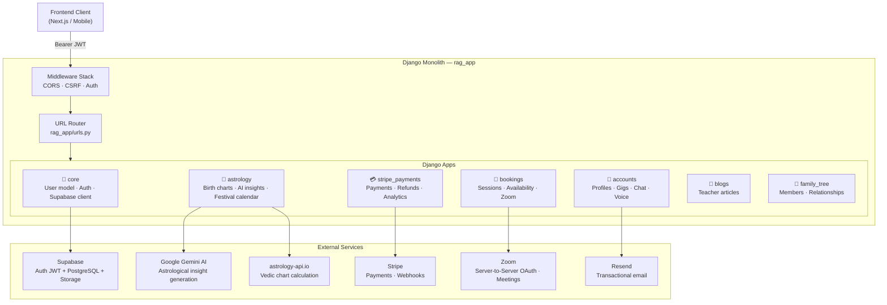

---

## Authentication Pipeline

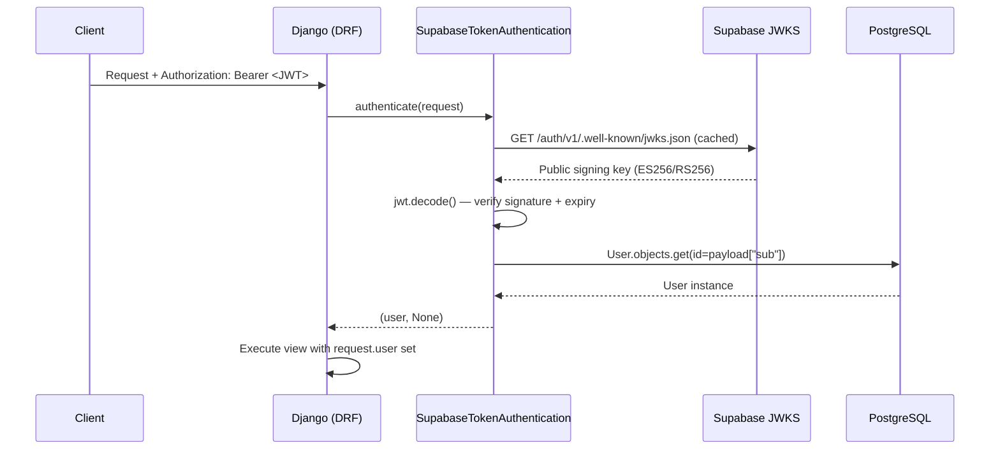

**Key points:**
- No passwords stored in Django — Supabase owns authentication
- JWKS client is a **module-level singleton** — key fetches are cached in-process
- User UUID in Django **matches** the Supabase `auth.users.id`
- Django admin login uses `ModelBackend` (separate path for superusers)

---

## Module-by-Module Breakdown

### 🔐 `core` — Foundation

| File | Responsibility |
|---|---|
| `models.py` | Custom `User` (AbstractBaseUser) with roles: `STUDENT`, `TEACHER`, `BOTH`, `ADMIN` |
| `authentication.py` | `SupabaseTokenAuthentication` — JWKS JWT verifier |
| `supabase_client.py` | Admin Supabase SDK client (server-side only) |
| `encryption.py` | Fernet-based field-level encryption helpers |
| `views.py` | Auth sync, Google OAuth, password reset, voice sessions |
| `urls.py` | `/api/` — auth/session endpoints |

**User model highlights:**
```
User
 ├── id          UUID (= Supabase sub)
 ├── email       unique
 ├── role        STUDENT | TEACHER | BOTH | ADMIN  (nullable)
 ├── auth_provider  EMAIL | GOOGLE
 ├── is_oauth_user
 └── email_verified
```

---

### 👤 `accounts` — Profiles, Gigs & Messaging

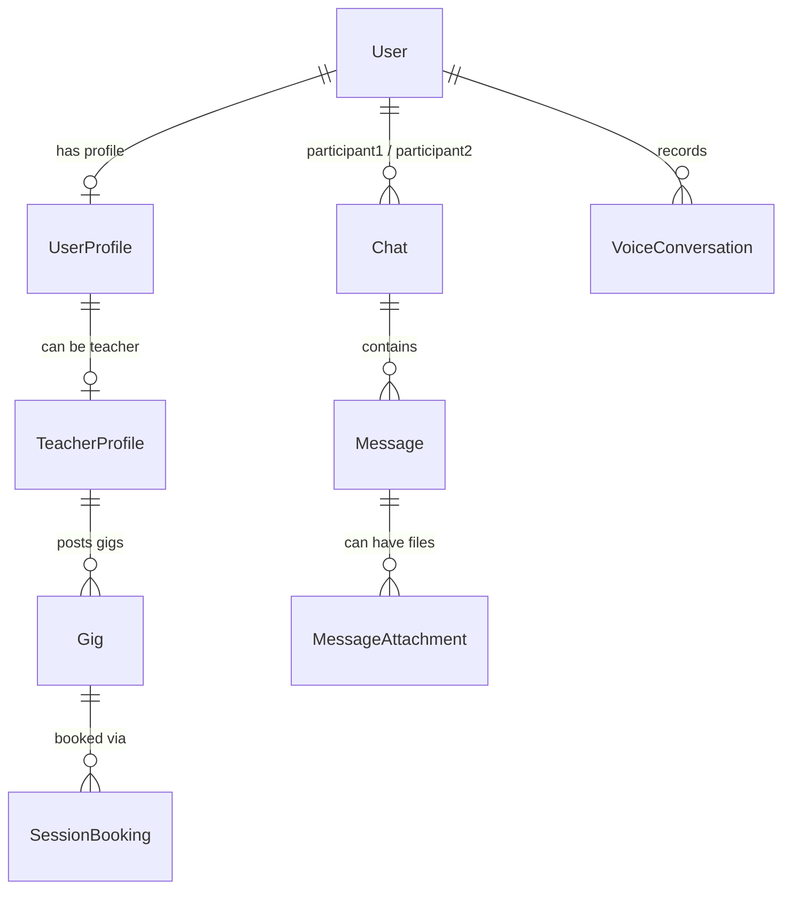

| Model | Purpose |
|---|---|
| `UserProfile` | Bio, city, country, native/learning language |
| `TeacherProfile` | Qualification, experience, certificates, hourly rate, `is_verified` |
| `Gig` | Service listings (language / astrology / general) with price & duration |
| `Chat` + `Message` + `MessageAttachment` | P2P messaging with Supabase Storage file uploads |
| `VoiceConversation` | Stores OpenAI speech-to-speech session transcription + AI feedback |

**Key API routes** (`/api/accounts/`):
- `POST /sync-supabase/` — Creates Django user row from Supabase token
- `POST /set-role/` — Assigns STUDENT or TEACHER role (upgrades to BOTH)
- `GET /profiles/me/roles/` — Returns unified role status with self-healing
- `GET/PATCH /profiles/teacher/` — Teacher profile management
- `GET /teachers/` — Browse verified teachers
- `GET/POST /gigs/` — Teacher gig management

---

### 📅 `bookings` — Session Scheduling

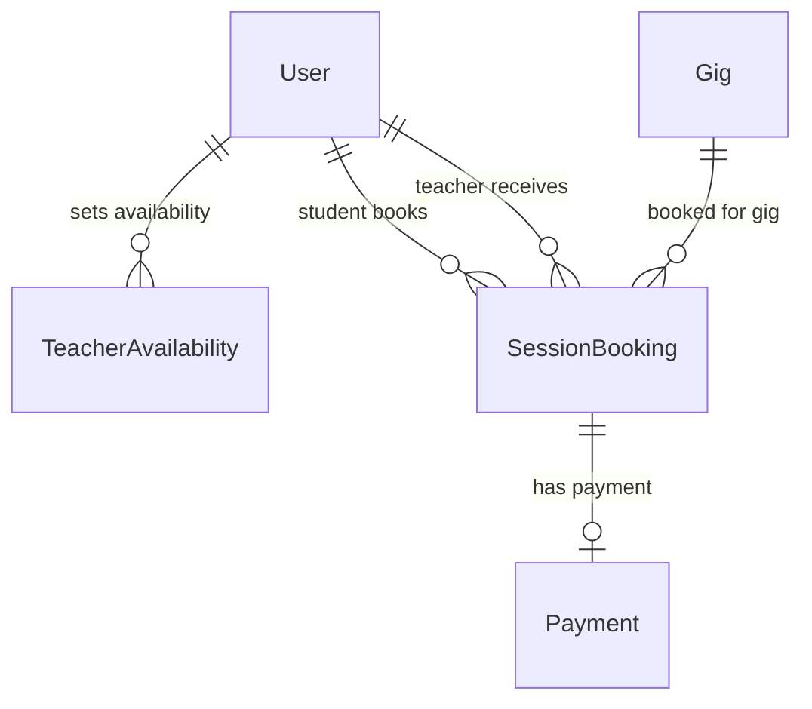

| Model | Purpose |
|---|---|
| `TeacherAvailability` | Weekly recurring or one-off slots (day-of-week + time range) |
| `SessionBooking` | Full lifecycle: PENDING → CONFIRMED → COMPLETED/CANCELLED + reschedule workflow |

**Zoom integration** (`zoom_service.py`):
- Server-to-Server OAuth token (auto-refreshed)
- Creates a Zoom meeting on booking confirmation
- Stores `zoom_meeting_id`, `zoom_join_url`, `zoom_start_url`, `zoom_password`

**Booking statuses:** `PENDING → CONFIRMED → COMPLETED / CANCELLED`  
**Reschedule workflow:** Either party requests → other confirms/declines → history preserved

---

### 💳 `stripe_payments` — Payments

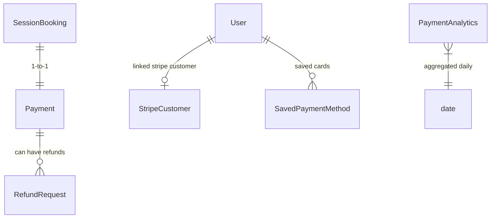

| Model | Purpose |
|---|---|
| `Payment` | Stripe PaymentIntent tracking, platform fee calculation (5%), status lifecycle |
| `SavedPaymentMethod` | Tokenized card display (brand, last 4) — never stores raw card data |
| `RefundRequest` | Student-initiated → admin review → Stripe refund |
| `StripeCustomer` | 1-to-1 link between `User` and `stripe.Customer` |
| `PaymentAnalytics` | Daily aggregated metrics for admin dashboard |

**Payment flow:**
1. Student creates `PaymentIntent` via `/api/payments/create-intent/`
2. Frontend confirms card with Stripe.js
3. Stripe sends webhook → Django updates `Payment.status`
4. `SessionBooking.payment_status` updated accordingly

---

### 🔮 `astrology` — Vedic Astrology Engine

This is the most complex module. It has several distinct layers:

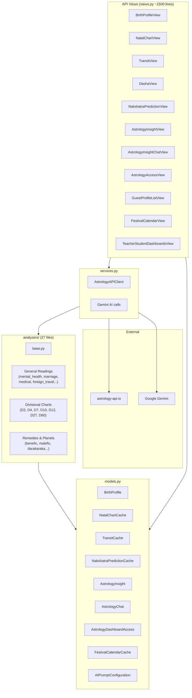

**Data flow for an insight request:**

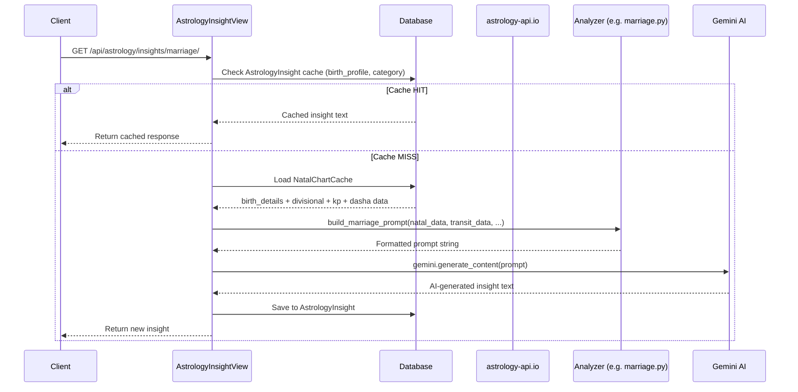

**Caching strategy:**

| Cache Model | Key | TTL |
|---|---|---|
| `NatalChartCache` | `birth_profile` (1-to-1) | Forever (birth data never changes) |
| `TransitCache` | `(birth_profile, date)` | Per calendar day |
| `NakshatraPredictionCache` | `birth_profile` (1-to-1) | Expires at local midnight |
| `AstrologyInsight` | `(birth_profile, category)` | Forever unless invalidated |
| `FestivalCalendarCache` | `(year, festival_type, language, region)` | Forever (static yearly data) |

**Encryption:** Birth data fields (`birth_year`, `birth_month`, `city`, etc.) use Fernet symmetric encryption via `EncryptedCharField` / `EncryptedIntegerField`.

**Teacher–Student dashboard access:**

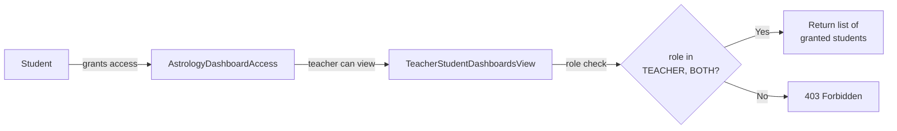

**Analyzers breakdown** (`analyzers/`):

| File | Category |
|---|---|
| `base.py` | `BaseAnalyzer` ABC |
| `mental_health.py` | Mental health reading |
| `marriage.py` | Marriage timing analysis |
| `medical.py` | Medical astrology |
| `foreign_travel.py` | Foreign travel & settlement |
| `btr.py` | Birth time rectification |
| `darakaraka.py` | Spouse profile (Jaimini) |
| `d2_hora.py` | D2 Hora chart |
| `d4_chaturthamsha.py` | D4 Chaturthamsha chart |
| `d7_saptamsha.py` | D7 Saptamsha chart |
| `d10_dashamsha.py` | D10 Dashamsha chart |
| `d12_dwadashamsha.py` | D12 Dwadashamsha chart |
| `d27_saptavimshamsha.py` | D27 Saptavimshamsha chart |
| `d60_shashtiamsha.py` | D60 Shashtiamsha chart |
| `benefic_planets.py` | Benefic planet analysis |
| `malefic_planets.py` | Malefic planet analysis |
| `chart_analysis.py` | General chart analysis |
| `planetary_states.py` | Planetary avatars & states |
| `lagna_lord.py` | Lagna lord position |
| `rashi_planets.py` | Rashi planet meanings |
| `challenges.py` | Challenges & learning |
| `parasari.py` | Parasari relationships |
| `navatara.py` | Navatara (nine stars) |
| `prosperity_sav.py` | Prosperity & career (SAV) |
| `astro_energy.py` | 12-dimensional astro energy |
| `daily_tara.py` | Daily Tara Bala |
| `navatara.py` | Navatara logic |

---

### 📝 `blogs` — Teacher Content

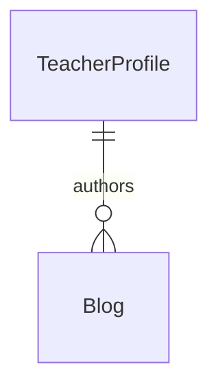

| Feature | Detail |
|---|---|
| Statuses | `DRAFT → PUBLISHED → ARCHIVED` |
| Auto-slug | Generated from title, deduplicated with counter |
| Read time | Auto-calculated (word count / 200 wpm) |
| Storage | Thumbnails stored via Supabase Storage bucket |
| SEO | `meta_description`, `slug`, `published_at` |

---

### 🌳 `family_tree` — Genealogy

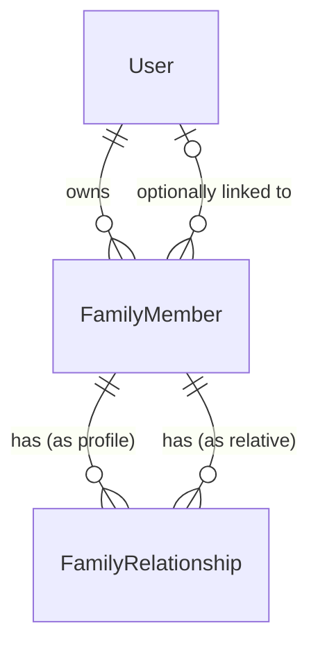

Simple graph structure:
- **`FamilyMember`** — a person in the tree (may optionally link to a registered `User`)
- **`FamilyRelationship`** — directed edge: `(profile) --[PARENT|SPOUSE]--> (relative)`
- Fully tested with 14 integration tests

---

## URL Map

| Prefix | Module | Key Endpoints |
|---|---|---|
| `/admin/` | Django Admin | Built-in admin panel |
| `/api/` | `core` | sync-supabase, set-role, google-oauth, password-reset, voice |
| `/api/accounts/` | `accounts` | profiles, teachers, gigs, chats, messages |
| `/api/bookings/` | `bookings` | sessions, availability, reschedule |
| `/api/payments/` | `stripe_payments` | create-intent, webhook, refunds, saved-methods |
| `/api/astrology/` | `astrology` | birth-profile, natal-chart, transits, dasha, nakshatra, insights, chat, access, festival-calendar |
| `/api/family-tree/` | `family_tree` | members, relationships |
| `/api/blogs/` | `blogs` | CRUD for blog posts |
| `/docs/` | drf-spectacular | Swagger UI |
| `/redoc/` | drf-spectacular | ReDoc |
| `/schema/` | drf-spectacular | Raw OpenAPI JSON |

---

## Role-Based Access Control

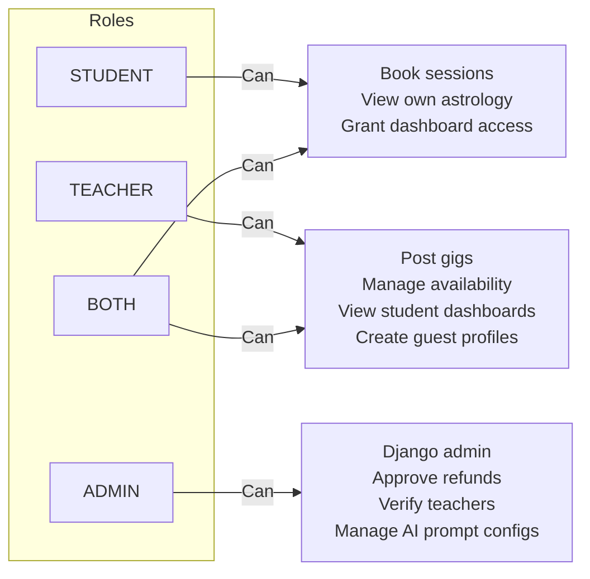

**Role elevation flow:**
1. New user signs up → `role = null`
2. Calls `POST /api/set-role/` with `{"role": "STUDENT"}` or `{"role": "TEACHER"}`
3. If they later add the other role → automatically upgraded to `BOTH`
4. `GET /api/accounts/profiles/me/roles/` is the source of truth (with self-healing DB correction)

---

## External Service Integration Map

| Service | Used By | Purpose |
|---|---|---|
| **Supabase Auth (JWKS)** | `core.authentication` | JWT signature verification (cached) |
| **Supabase DB** | All apps | Primary PostgreSQL database |
| **Supabase Storage** | `accounts` (chat files), `blogs` (thumbnails) | File storage (user uploads, blog images) |
| **Google Gemini AI** | `astrology` | AI-generated astrological insight text |
| **astrology-api.io** | `astrology.services.AstrologyAPIClient` | Vedic chart calculation (natal, transit, dasha, etc.) |
| **Stripe** | `stripe_payments` | Payment intents, webhooks, refunds, saved cards |
| **Zoom (S2S OAuth)** | `bookings.zoom_service` | Auto-create meeting rooms on booking confirmation |
| **Resend** | `chat.services.email` | Transactional email (notifications) |
| **Google OAuth** | `core.views` | One-tap / OAuth sign-in |

---

## Database Schema Relationships (Cross-Module)

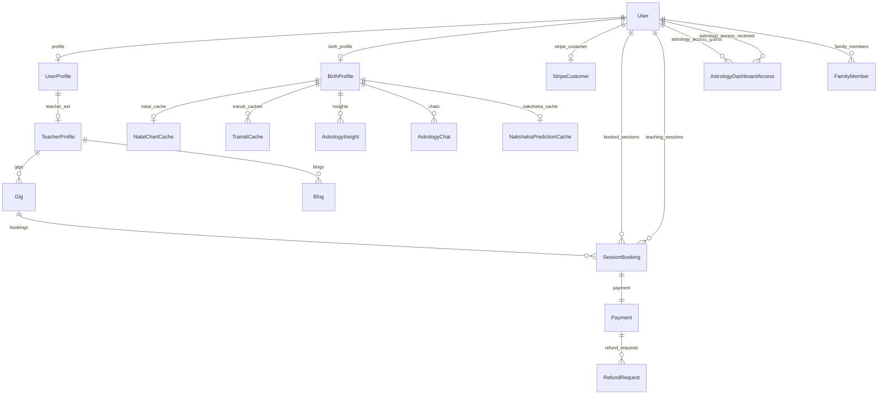

---

## Key Architectural Decisions

| Decision | Rationale |
|---|---|
| **Supabase Auth only** — Django doesn't store passwords | Single auth source of truth; enables Google OAuth, magic links, etc. without extra Django packages |
| **Field-level encryption** on birth data | PII protection for sensitive birth details even if DB is compromised |
| **Multi-tier caching** for astrology | Natal chart data never changes — cache forever. Transit data changes daily. Cuts API costs significantly. |
| **Analyzer pattern** (27 focused files) | Each astrology category lives in its own file with its own prompt builder — easy to add/modify without touching others |
| **Role = `BOTH`** | Allows a single account to be both a teacher and student (e.g. astrologer who also takes language courses) |
| **`AstrologyDashboardAccess`** as explicit grant | Student explicitly grants teacher access rather than implicit role-based read — privacy first |
| **drf-spectacular sidecar** | Swagger/ReDoc assets served locally, no CDN dependency, works offline |
