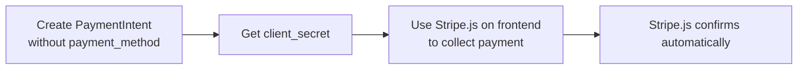
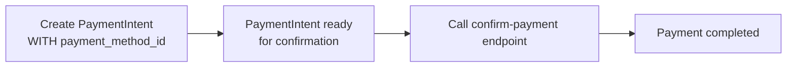

# 🔧 Payment Method Error - Complete Solution

## ❌ **Your Error**
```json
{
    "error": "Payment confirmation error: Request req_0C5PXMzAR1KT0x: You cannot confirm this PaymentIntent because it's missing a payment method. To confirm the PaymentIntent with cus_T1Rref6EYmnReU, specify a payment method attached to this customer along with the customer ID."
}
```

## 🔍 **Root Cause**
You created a PaymentIntent **without** a payment method, which is designed for frontend integration where Stripe.js collects the payment details. For direct API testing, you need to provide a payment method.

## ✅ **Solution: Use Test Payment Method**

### For API Testing (What You Need):

**1. Create PaymentIntent with Payment Method:**
```bash
POST {{base_url}}/api/payments/create-payment-intent/
Authorization: Bearer {{student_token}}
Content-Type: application/json

{
  "session_booking_id": 1,
  "payment_method_id": "pm_card_visa",
  "save_payment_method": true
}
```

**2. Then Confirm (This Will Work):**
```bash
POST {{base_url}}/api/payments/confirm-payment/
Authorization: Bearer {{student_token}}
Content-Type: application/json

{
  "payment_intent_id": "pi_3S5P5VDqk1yzATZk4pv00aM0"
}
```

### Available Test Payment Methods:
- `pm_card_visa` - Visa test card (recommended)
- `pm_card_mastercard` - Mastercard test card
- `pm_card_amex` - American Express test card
- `pm_card_decline` - Card that will be declined
- `pm_card_visa_debit` - Visa debit card
- `pm_card_chargeDispute` - Card that will trigger dispute

## 📋 **Two Different Integration Flows**

### Flow 1: Frontend Integration (Your Original Request)


**Use Case**: Real web/mobile app integration
**Request**: Without `payment_method_id`
**Confirmation**: Handled by Stripe.js frontend

### Flow 2: Direct API Testing (What You Need)


**Use Case**: API testing, backend integration
**Request**: With `payment_method_id`
**Confirmation**: Direct API call

## 🎯 **Step-by-Step Fix**

### Step 1: Create Payment Intent (Corrected)
```bash
POST http://127.0.0.1:8000/api/payments/create-payment-intent/
Authorization: Bearer YOUR_STUDENT_TOKEN
Content-Type: application/json

{
  "session_booking_id": 1,
  "payment_method_id": "pm_card_visa",
  "save_payment_method": true
}
```

**Expected Response:**
```json
{
  "success": true,
  "client_secret": "pi_3NewPaymentIntent123_secret_abc",
  "payment_id": 2,
  "amount_dollars": 25.00
}
```

### Step 2: Confirm Payment (Will Work Now)
```bash
POST http://127.0.0.1:8000/api/payments/confirm-payment/
Authorization: Bearer YOUR_STUDENT_TOKEN
Content-Type: application/json

{
  "payment_intent_id": "pi_3NewPaymentIntent123"
}
```

**Expected Response:**
```json
{
  "success": true,
  "status": "succeeded",
  "requires_action": false,
  "client_secret": null
}
```

## 📚 **Updated Postman Collection**

I've updated your Postman collection with two versions:

1. **"Create Payment Intent (Frontend Flow)"** - Without payment method
2. **"Create Payment Intent (API Testing)"** - With payment method ✅

Use the second one for API testing!

## 🧪 **Test Script**

Run the test script I created:
```bash
python test_payment_method_flow.py
```

This will demonstrate both flows and show you the difference.

## 💡 **Key Points**

- ✅ **For API Testing**: Always include `payment_method_id`
- ✅ **For Frontend**: Use without `payment_method_id` + Stripe.js
- ✅ **Test Payment Methods**: Use Stripe's built-in test payment methods
- ✅ **No Real Cards Needed**: Test payment methods simulate real cards

## 🔄 **Next Steps**

1. Use the corrected request with `payment_method_id: "pm_card_visa"`
2. Create PaymentIntent 
3. Confirm payment (should work now)
4. Check payment status in your payments list

Your payment confirmation should work perfectly now! 🚀

---
*Solution Date: September 9, 2025*
*Issue: Missing payment method for API testing*
